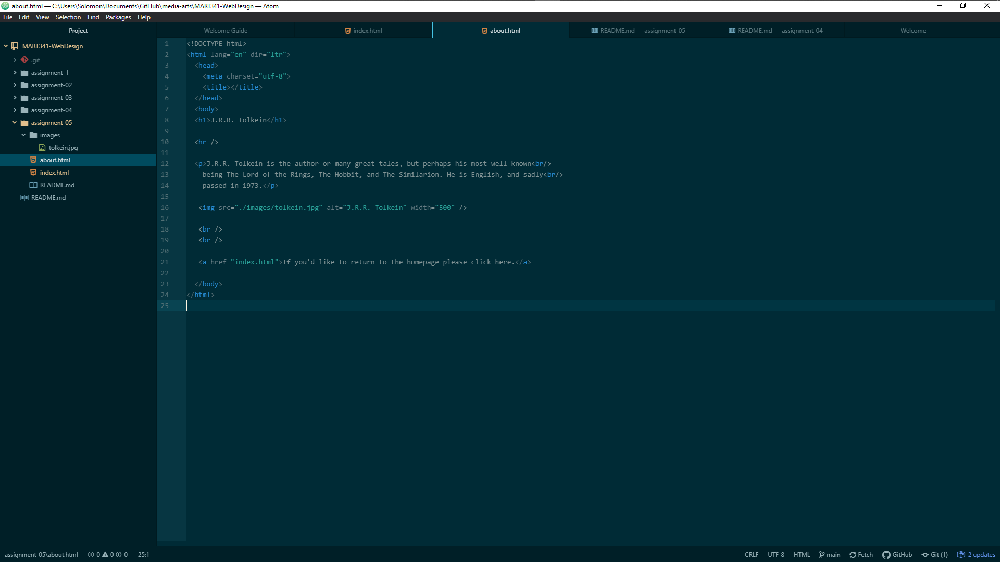

1) The site I visited was a steaming site for video games known as Twitch.
The site itself was actually really plain. Basically all that was available to
read was the text of the stream title and the game the gamer was playing.
There also weren't as many games being streamed, and overall the website looked
super simple. Now it has different color schemes, all the games you can think
of, a more interactive chat, and so on. It has changed a ton visually and
definitely for the better. But I think something cool is that while there
is more content now, it is still pretty similar to what it was then. In fact
there was even links providing the old streamers accounts now!

2) My experience with these last couple of topics was good! I payed more attention
this time around when it came to learning tags which was nice. I didn't know about
the ```<hr />``` tag so I'm also really enjoying using that. Actually most of this
weeks content was pretty easy, since I've done some similar stuff before.
I still forget about how to embed images and such every once in a while but it's
easy to look up on the site.


